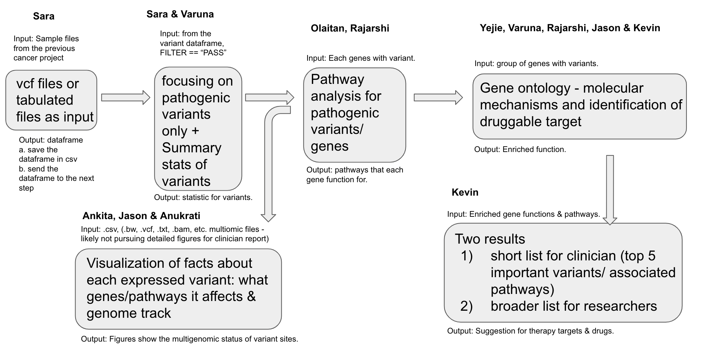

# Viewing_expressed_variants


## Contributors
-  Kevin Elaba, Ankita Murmu, Rajarshi Mondal, Anukrati Nigam, ChunHsuan LO (Jason) - **Sysadmin**
-  Ahmad Khleifat, Olaitan I. Awe, Varuna Chander - **Tech support**
-  Sara Carioscia, Yejie Yun - **Writer**
-  Kevin Elaba - **Slides construction**
-  Yejie Yun, Anukrati Nigam - **Results presenter & advertisements**
-  Yejie Yun, Rajarshi Mondal, Ankita Murmu, Olaitan I. Awe, ChunHsuan LO (Jason) - **Github maintenance**
-  ChunHsuan LO (Jason) - **Lead, Liaison**


## Goal
To visualize the expression profiles and pathways associated with pathogenic variants for suggesting clinical therapy target and drug usage for Colorectal Cancer. The tool is intended to generate visualizations with a clinical focus.


## Introduction
The advancements in next-generation sequencing revolutionized the field of genonmics, allowing researchers to construct gene expression profiles and identify potential pathogenic variants. Although next-generation sequencing has led to a leap in sequencing technology, there remains significant challenges in translating the information from data to insights in a clinical setting. Expression of variants has significant clinical relevance. Analysis of variant expression and its associated cellular pathways can be used to assess cancer risk, clinical outcomes, and possible treatment targets. However, interpretation of variant expression in a clinical setting is an ongoing challenge. For those who are not genetics specialists, raw data regarding expression of genetic variants can be uninformative. Here we aim to translate variant expression data into clinically relevent infromation for health care professionals and patients identifying pathogenic variants, associated cellular pathways, and suggestions for clinical therapy targets.


## Idea Outlines


## Example Data
#### Option 1: Filtered .vcf files from github  <br/>
_(Provided by: https://github.com/collaborativebioinformatics/expression_and_SNPs_to_clinic)_  <br/>
-  testSample.cancer.tab <br/>
-  testSample.cancer.vcf <br/>
-  testv25.variants.HC_hard_cutoffs_applied.cancer.tab <br/>
-  testv25.variants.HC_hard_cutoff_applied.cancer.vcf <br/>
#### Option 2: Raw .vcf files & paired multi-omic data from TCGA  <br/>
_(Provided by: https://portal.gdc.cancer.gov/)_  <br/>
-  TCGA-44-6164 (case ID) <br/>

-- https://portal.gdc.cancer.gov/repository?facetTab=files&filters=%7B%22op%22%3A%22and%22%2C%22content%22%3A%5B%7B%22content%22%3A%7B%22field%22%3A%22cases.case_id%22%2C%22value%22%3A%5B%220c0b610e-fe4c-406d-a5ed-5cc3b11dabf5%22%5D%7D%2C%22op%22%3A%22in%22%7D%5D%7D&searchTableTab=files <br/>
-- https://portal.gdc.cancer.gov/repository?facetTab=files&filters=%7B%22op%22%3A%22and%22%2C%22content%22%3A%5B%7B%22content%22%3A%7B%22field%22%3A%22cases.case_id%22%2C%22value%22%3A%5B%220c0b610e-fe4c-406d-a5ed-5cc3b11dabf5%22%5D%7D%2C%22op%22%3A%22in%22%7D%5D%7D&searchTableTab=files


## Installation
**1.** Installing the Git Repository as a Package
```
devtools::install_github("collaborativebioinformatics/Viewing_expressed_variants")
```
**2.** Software Requirements

The following expression variants analysis tools have been installed in this singularity container:

```
R version 4.0.4 (2021-02-15) -- "Lost Library Book"
Bioconductor: 3.12
ggplot2: 3.3.5
gridExtra: 2.3
dplyr: 1.0.7
tidyr: 1.1.4
magrittr: 2.0.2
rWikiPathways: 1.10.0
ggradar: 0.2
ggpubr: 0.4.0
data.table: 1.14.2

```

**3.** Setting up the Environment

A singularity container was built to run the expression variants analysis and visualization pipeline. The [recipe file](def/expressed_variants.def) is available in this Git repository.

To build the singularity container on your unix environment, do:
```
singularity build expressed_variants.sif def/expressed_variants.def
```

To run the container on your unix environment, do:
```
singularity run expressed_variants.sif
```

To run specific R packages by using the container, do:
```
singularity exec expressed_variants.sif Rscript <path_to_script>
```


## Methods

### Inputs:
_VCF file (sample-> online data base - 1000 genome, TCGA, or etc.) + RNAseq bam file_
1. Expressed variants (VCF files from RNA-seq data) 

### Outputs:
1. Summary statistics of expressed variants and pathogenic variants.
2. Gene ontology and KEGG Pathway analysis for the expressed pathogenic variants.
3. Potential clinical targets.

### Detailed flow charts:



## Implementation (codes)

### (step 1) Preparing the Sample Files:<br/>
****
<br/>
```
## Hackathon
library(data.table) # for data.table functions
library(dplyr) # for pipe, filter, str_detect

# read in full file, espite variable number of fields at first
all_content <- readLines("/Users/saracarioscia/Downloads/testSample.cancer.vcf")
# skip until we get to the fixed area header
variant_rows <- all_content[-c(1:grep("#CHROM", all_content))]
# read back in the fixed lines as a table
variants <- read.table(textConnection(variant_rows))

# get only pathogenic variants
variants_dt <- variants %>% as.data.table()
pathogenic_variants <- variants_dt %>%
  filter_all(any_vars(str_detect(., pattern = "PATHOGENIC")))
# write it back as a csv
write.csv(pathogenic_variants, "~/Downloads/pathogenic_variants.csv", row.names = FALSE, quote = FALSE)

# Format is `|GENE=gene_name|`. Try to grab the content between GENE= and |
for (i in 1:nrow(pathogenic_variants)) {
  # go through each row of the pathogenic variants
  row <- pathogenic_variants[i,]
  # grab the content after GENE=
  gene <- str_match(row, "GENE=\\s*(.*?)\\s*;")
  # other rows are grabbed; we want those that are not NA
  gene <- gene[,2][!is.na(gene[,2])]
  # assign the gene to the column in pathogenic_variants
  pathogenic_variants$genes[i] <- gene
}

```

### (step 2) Data Cleaning for VCF Files or Tabulated Files as Input (Sara):<br/>
**2.**<br/>
```
(codes)
```

### (step 3) Focusing on Pathogenic Variants only (Sara & Varuna):<br/>
**3.**<br/>

```
(code)   
 
```

### (step 4) Gene Ontology and Pathway Analysis for Pathogenic Variants & Genes (Yejie, Varuna, Kevin,and Anukrati):<br/>
**4a.**<br/>
```
library(gprofiler2)
# grabs from data output, check this path w group?
path_data <- read.csv("../data_output/pathogenic_variants_try.csv")
gene_ids <- as.list(path_data[,5])

# query for KEGG + REAC
gostres <- gost(query = gene_ids, 
                organism = "hsapiens", sources = c("KEGG","REAC"))

ens_id <- data.frame(gostres$meta$genes_metadata$query)
ens_id <- data.frame(t(ens_id))
ens_id <- unique(ens_id)
ens_id$geneInfo <- rownames(ens_id)
ens_id_data <- gostres$result

spl <- t(data.frame(strsplit(ens_id$geneInfo, split='.', fixed=TRUE)))
colnames(spl) <- c("queryID","geneName")
ens_id_df <- cbind(ens_id, spl)

gene_pathway_association <- dplyr::left_join(ens_id_data, ens_id_df, by = c("query" = "queryID"))
gene_pathway_association %>% ggplot2::ggplot(aes(x = term_name, y = geneName, fill =term_name)) +
  geom_tile(show.legend = F) +
  theme_bw() +
  theme(panel.grid.major = element_blank(),
        panel.grid.minor = element_blank(),
        axis.text.x = element_text(angle = 90))+
  labs(title = "Genes and Pathway association",x = "Pathways", y = "Genes")
ggsave("../pictures/gene_pathway_association.png")


pathdf <- gene_pathway_association %>% dplyr::group_by(term_name) %>% dplyr::tally()
pathdf %>% ggplot2::ggplot(aes(x = term_name, y = n, fill = term_name, label = n)) +
  geom_bar(width = 1, stat = "identity", color = "white") +
  geom_text()+
  theme_bw()+
  labs(fill = "Pathways", title = "Common pathways")+
  theme(axis.title = element_blank(),
        axis.line = element_blank(),
        axis.text.x = element_blank(),
        axis.ticks = element_blank(),
        axis.text.y = element_blank())+
  coord_polar()
ggsave("../pictures/common_pathways.png")

# query for GO
gostres <- gost(query = gene_ids, 
                organism = "hsapiens", sources = "GO")

ens_id <- data.frame(gostres$meta$genes_metadata$query)
ens_id <- data.frame(t(ens_id))
ens_id <- unique(ens_id)
ens_id$geneInfo <- rownames(ens_id)
ens_id_data <- gostres$result

spl <- t(data.frame(strsplit(ens_id$geneInfo, split='.', fixed=TRUE)))
colnames(spl) <- c("queryID","geneName")
ens_id_df <- cbind(ens_id, spl)

GO_association <- dplyr::left_join(ens_id_data, ens_id_df, by = c("query" = "queryID"))
GO_association %>% ggplot2::ggplot(aes(x = term_name, y = geneName, fill =term_name)) +
  geom_tile(show.legend = F) +
  theme_bw() +
  theme(panel.grid.major = element_blank(),
        panel.grid.minor = element_blank(),
        axis.text.x = element_text(angle = 90))+
  labs(title = "Genes and Gene Ontology association",x = "Gene Ontology", y = "Genes")
ggsave("../pictures/gene_GO_association.png")
```
** Molecular mechanisms:**<br/>
```
(code)
```
** Identification of druggable target:**<br/>
```
(code)
```

### (step 5) Results Integration and Visualization:<br/>
_PS. Two results short list for clinician<br/>_

** Showing Top 5 important variants/ associated pathways for clinicians:**<br/>
```
(codes)
```
** Broader list for researchers:**<br/>
```
(codes)
```

### (step 6) Visualization :<br/>
**Visualization of facts about expressed variants: what genes/pathways it affects:**<br/>
```
# Read in df
df <- read.csv("~/pathogenic_variants.csv", header = T)
colnames(df) <- c("CHR","POS","REF","ALT","FILTER","VariantImpact","GENE")

# Plot variant distribution figure

df %>% ggplot2::ggplot(aes(x=VariantImpact, fill = VariantImpact))+
  geom_bar()+
  theme(axis.text.x = element_text(angle = 90)) +
  geom_text(aes(label = ..count..), stat="count",vjust = -0.5, colour = "black")+
  labs(title = "Pathogenic variants impact",
       x = "Variant Type",
       y = "Number of variants", 
       fill = "Variant Impact")
ggsave("../pictures/pathogenic_variants_impact.png")
  
df %>% ggplot2::ggplot(aes(x=GENE, y = VariantImpact, fill = VariantImpact, colour - "white"))+
  geom_tile(show.legend = F)+
  theme(axis.text.x = element_text(angle = 90)) +
  labs(title = "Genes with variants and their impact",
       x = "Genes",
       y = "Variant Impact")
ggsave("../pictures/gene-genetic_variant_association.png")   
```
**6b. Visualization of genome tracks where variants located:**<br/>
<details>
<summary>
- Click to view the R Codes

```
#CMUHackathon_visualization_Genometrack_datapreparing.R
```

</summary>

```
####＝＝＝＝＝＝＝＝＝＝Environments setting＝＝＝＝＝＝＝＝＝＝
target_case="TCGA_44_6146"

library("icesTAF")
server="/Users/chunhsuanlojason/Desktop/CMU_Libraries_Hackathon"
dir_input_workingspace=paste(server, "workingspace", sep="/")
dir_input_epigenetics=paste(server, "TCGA_raw_data", sep="/")
dir_temp=paste(server, "temp_CMUHackathon_visualization_Genometrack", sep="/")
mkdir(dir_temp)
dir_output=paste(server, "output", sep="/")
mkdir(dir_output)


####＝＝＝＝＝＝＝＝＝＝Data importing & initializing: VariantsSites & ATAC-Seq & methylation_HM450 & RNAseq＝＝＝＝＝＝＝＝＝＝
##===data_import_VCF===
library("AnnotationHub")
library("VariantAnnotation")

input_targeted_vcf_file <- function(caseID){
  print(caseID)
  filelist_target <- as.data.frame(list.files(dir_input_workingspace, pattern=".vcf"))
  colnames(filelist_target) = "file"
  filename=paste(caseID, "_WES_somaticvariants",".vcf",sep="")

  targeted_vcf_file_path <- paste(dir_input_workingspace, filename, sep="/")
  targeted_vcf_file <- readVcf(targeted_vcf_file_path)

  return(targeted_vcf_file)
}

assign(paste(target_case, "_input_targeted_vcf_file", sep=""), input_targeted_vcf_file(paste(target_case, sep="")))
#View(`TCGA_44_6146_input_targeted_vcf_file`)
#View(get(paste(target_case, "_input_targeted_vcf_file", sep="")))
##=====================

##===data_import_CSV===
#(omit)
#=GenomicRanges_construction=
#GenomicRanges_construction <- function(caseID){
#  print(caseID)
#  if(!is.na(print(as.vector(as.character(get(paste(caseID, "targeted_genes_list", sep=""))[,4])))) && !identical(print(as.vector(as.character(get(paste(caseID, "targeted_genes_list", sep=""))[,4]))), character(0))){
#    BAEgenes_GenomicRanges <- GRanges(
#      #=====(necessary parameters)#
#      seqnames = as.vector(as.character(get(paste(caseID, "targeted_genes_list", sep=""))[,1])),
#      ranges = IRanges(start = as.vector(as.numeric(get(paste(caseID, "targeted_genes_list", sep=""))[,2])), end = as.vector(as.numeric(get(paste(caseID, "targeted_genes_list", sep=""))[,3]))),
#      strand = Rle("*",nrow(get(paste(caseID, "targeted_genes_list", sep="")))),
#      #=====(unnecessary parameters)#
#      symbol = as.vector(as.character(get(paste(caseID, "targeted_genes_list", sep=""))[,4])),
#      dominant = as.vector(as.character(get(paste(caseID, "targeted_genes_list", sep=""))[,5])),
#      snp_position = as.vector(as.character(get(paste(caseID, "targeted_genes_list", sep=""))[,10])),
#      allelic_fraction_dR_dA_rR_rA = as.vector(as.character(get(paste(caseID, "targeted_genes_list", sep=""))[,11])),
#      note = as.vector(as.character(get(paste(caseID, "targeted_genes_list", sep=""))[,14]))
#    )
#    return(BAEgenes_GenomicRanges)
#  }
#  return(0)
#}
#
#assign(paste(target_case, "_genes_GenomicRanges", sep=""), GenomicRanges_construction(target_case))
##View(`TCGA_44_6146_genes_GenomicRanges`)
##View(get(paste(target_case, "_genes_GenomicRanges", sep="")))
##=====================

##===building_genomicranges_target_variants===
#(omit)
#get(paste(target_case, "_input_targeted_vcf_file", sep=""))
#
#targeted_gene <- GRanges(
#  #=====(necessary parameters)#
#  seqnames = as.vector(seqnames(BAEgene[target_gene_rowcount, ])),
#  ranges = IRanges(start = start(ranges(BAEgene[target_gene_rowcount, ])), end = end(ranges(BAEgene[target_gene_rowcount, ]))),
#  #=====(unnecessary parameters)#
#  symbol = BAEgene[target_gene_rowcount, ]$symbol,
#  dominant = BAEgene[target_gene_rowcount, ]$dominant,
#  snp_position = BAEgene[target_gene_rowcount, ]$snp_position,
#  note = BAEgene[target_gene_rowcount, ]$note   
#)
##=====================

##===data_import_and_preprocess_(Srtructure_Variants_VCF)===
SV_vcf_files_input <- function(caseID){
  print(caseID)

  filelist_target <- as.data.frame(list.files(dir_input_workingspace, pattern=".vcf"))
  colnames(filelist_target) = "file"
  filename=paste(caseID, "_Tumor_WGS_TEinsertions",".vcf",sep="")
  targeted_vcf_file_path <- paste(dir_input_epigenetics, filename, sep="/")
  targeted_vcf_file_Tumor_SV <- readVcf(targeted_vcf_file_path)

  filelist_target <- as.data.frame(list.files(dir_input_workingspace, pattern=".vcf"))
  colnames(filelist_target) = "file"
  filename=paste(caseID, "_Blood_WGS_TEinsertions",".vcf",sep="")
  targeted_vcf_file_path <- paste(dir_input_epigenetics, filename, sep="/")
  targeted_vcf_file_Blood_SV <- readVcf(targeted_vcf_file_path)

  ERVcaller_WGS_vcf_files <- list("Tumor"=targeted_vcf_file_Tumor_SV, "Blood"=targeted_vcf_file_Blood_SV)
  return(ERVcaller_WGS_vcf_files)
}

print(target_case)
assign(paste(target_case, "SV_vcf_files", sep=""), SV_vcf_files_input(target_case))
#View(get(paste(target_case, "SV_vcf_files", sep="")))

##=====================

##===data_import_and_preprocess_(methylation_HM450)===
#$MethylationArray$(https://bioconductor.org/packages/release/workflows/vignettes/methylationArrayAnalysis/inst/doc/methylationArrayAnalysis.html)
#!PS: (SKIP:some files do not have DNAMethylation_HM450_solidnormal)
library("tidyr")
library("dplyr")

print("methylation_HM450")  
methylation_HM450_processing <- function(caseID){
  #===Data import===  
  print(caseID)
  filelist_target <- as.data.frame(list.files(dir_input_epigenetics, pattern="HumanMethylation450array.txt"))
  colnames(filelist_target) = "file"

  filename_Tumor=paste(caseID, "_Tumor_HumanMethylation450array",".txt",sep="")
  targeted_file_Tumor_path <- paste(dir_input_epigenetics, filename_Tumor, sep="/")
  targeted_case_HM450_tumor <- read.table(targeted_file_Tumor_path, sep = '\t', header= TRUE, na = "NA", stringsAsFactors = F)

  filename_Solidnormal=paste(caseID, "_Solidnormal_HumanMethylation450array",".txt",sep="")
  targeted_file_Solidnormal_path <- paste(dir_input_epigenetics, filename_Solidnormal, sep="/")
  targeted_case_HM450_solidnormal <- read.table(targeted_file_Solidnormal_path, sep = '\t', header= TRUE, na = "NA", stringsAsFactors = F)

  #==Density plot for Beta Value==
  targeted_case_HM450_tumor_d_Betavalue <- density(na.omit(targeted_case_HM450_tumor$Beta_value)) # returns the density data
  png(filename=paste(dir_temp,"/", caseID, "_HM450_tumor_Betavalue.png", sep=""))
  plot.new()
  plot(targeted_case_HM450_tumor_d_Betavalue)
  dev.off()

  targeted_case_HM450_solidnormal_d_Betavalue <- density(na.omit(targeted_case_HM450_solidnormal$Beta_value)) # returns the density data
  png(filename=paste(dir_temp,"/", caseID, "_HM450_solidnormal_Betavalue.png", sep=""))
  plot.new()
  plot(targeted_case_HM450_solidnormal_d_Betavalue)
  dev.off()


  targeted_case_HM450_tumor <- mutate(targeted_case_HM450_tumor, M_value=as.numeric(log2((Beta_value+0.0001)/((1-Beta_value)+0.0001))))
  targeted_case_HM450_tumor_d_Mvalue <- density(na.omit(targeted_case_HM450_tumor$M_value))
  png(filename=paste(dir_temp,"/", caseID, "_HM450_tumor_Mvalue.png", sep=""))
  plot.new()
  plot(targeted_case_HM450_tumor_d_Mvalue)
  dev.off()

  targeted_case_HM450_solidnormal <- mutate(targeted_case_HM450_solidnormal, M_value=as.numeric(log2((Beta_value+0.0001)/((1-Beta_value)+0.0001))))
  targeted_case_HM450_solidnormal_d_Mvalue <- density(na.omit(targeted_case_HM450_solidnormal$M_value))
  png(filename=paste(dir_temp,"/", caseID, "_HM450_solidnormal_Mvalue.png", sep=""))
  plot.new()
  plot(targeted_case_HM450_solidnormal_d_Mvalue)
  dev.off()


  targeted_case_HM450_data <- list("tumor_HM450_rawdata"=targeted_case_HM450_tumor, "tumor_d_Betavalue"=targeted_case_HM450_tumor_d_Betavalue, "tumor_d_Mvalue"=targeted_case_HM450_tumor_d_Mvalue, "solidnormal_HM450_rawdata"=targeted_case_HM450_solidnormal, "solidnormal_d_Betavalue"=targeted_case_HM450_solidnormal_d_Betavalue, "solidnormal_d_Mvalue"=targeted_case_HM450_solidnormal_d_Mvalue)
  return(targeted_case_HM450_data)
}

assign(paste(target_case, "_methylation_HM450_processing", sep=""), methylation_HM450_processing(target_case))
#View(`TCGA-44-6146_methylation_HM450_processing`)
#View(get(paste(target_case, "_methylation_HM450_processing", sep="")))
```

</details>
<details>
<summary>
- Click to view the R Codes  

```
#CMUHackathon_visualization_Genometrack_plottingcore.R
```

</summary>  

```
####＝＝＝＝＝＝＝＝＝＝Data Visualization＝＝＝＝＝＝＝＝＝＝
##===(Plotting core)===
library("Rsamtools")
library("GenomicAlignments")
library("rtracklayer")
library("icesTAF")
library("magrittr")
library("Gviz")
library("GenomicRanges")
library("VariantAnnotation")

#--Loading_additional_annotation_track_(additionaltrack)--#
library("AnnotationHub")
ah <- AnnotationHub()
query(ah, c("Homo sapien", "CTCF", "hepG"))
id <- names(query(ah, "wgEncodeUwTfbsHepg2CtcfStdPkRep2.narrowPeak.gz"))
Hepg2Ctcf.gr <- ah[[tail(id, 1)]]

library("rtracklayer")
#library("liftOver")
path = system.file(package="liftOver", "extdata", "hg38ToHg19.over.chain")
ch = import.chain(path)
seqlevelsStyle(Hepg2Ctcf.gr) = "UCSC"
Hepg2Ctcf.gr_hg38 = liftOver(Hepg2Ctcf.gr, ch)
Hepg2Ctcf.gr_hg38 <- unlist(Hepg2Ctcf.gr_hg38)
#---------------------------------------------------------#

gene_range <- read.table(paste(dir_input_epigenetics, "GRCh38_hg38_refFlat_annotation_primaryAssemblyOnly_NoXY.bed", sep="/"), header = FALSE)
gene_range <- dplyr::rename(gene_range, chr = V1, start = V2, end = V3, ID = V4)
gene_range_filter <- gene_range %>% group_by(ID) %>% filter(row_number() == 1) %>% ungroup()
gene_range_filter <- as.data.frame(gene_range_filter)
#---------------------------------------------------------#

genomeTracksGrapgic_targetlocations <- function(target_case_in, temp_variants_filtered_in, count00_in, temp_targetgene_in){
  if(nrow(filter(gene_range_filter, ID==temp_targetgene_in))!=0){
    target_gene = filter(gene_range_filter, ID==temp_targetgene_in)[1,]
    target_gene_GRanges <- GRanges(
      #=====(necessary parameters)#
      seqnames = as.vector(target_gene$chr),
      ranges = IRanges(start = as.integer(target_gene$start), end = as.integer(target_gene$end)),
      #=====(unnecessary parameters)#
      symbol = as.character(target_gene$ID)
    )
    genome(target_gene_GRanges) = "hg38"

    TumorWGSTE <- get(paste(target_case, "SV_vcf_files", sep=""))$Tumor
    TumorWGSTE_rowRanges <- rowRanges(TumorWGSTE)
    genome(TumorWGSTE_rowRanges) = "hg38"

    BloodWGSTE <- get(paste(target_case, "SV_vcf_files", sep=""))$Blood
    BloodWGSTE_rowRanges <- rowRanges(BloodWGSTE)
    genome(BloodWGSTE_rowRanges) = "hg38"

    seqlevels(TumorWGSTE_rowRanges, pruning.mode="coarse") <- seqlevels(target_gene_GRanges)
    seqlevels(BloodWGSTE_rowRanges, pruning.mode="coarse") <- seqlevels(target_gene_GRanges)
    target_TumorWGSTE_rowRanges <- TumorWGSTE_rowRanges[(seqnames(TumorWGSTE_rowRanges) == as.character(seqnames(target_gene_GRanges))) & (start(TumorWGSTE_rowRanges) > (as.numeric(start(target_gene_GRanges))-1000000)) & (end(TumorWGSTE_rowRanges) < (as.numeric(end(target_gene_GRanges)) + 1000000))]
    target_BloodWGSTE_rowRanges <- BloodWGSTE_rowRanges[(seqnames(BloodWGSTE_rowRanges) == as.character(seqnames(target_gene_GRanges))) & (start(BloodWGSTE_rowRanges) > (as.numeric(start(target_gene_GRanges))-1000000)) & (end(BloodWGSTE_rowRanges) < (as.numeric(end(target_gene_GRanges)) + 1000000))]

    #=====visualization=====
    #target_CHR = as.character( seqnames(granges(temp_variants_filtered_in[count00_in])) )
    #target_START = as.numeric( start(granges(temp_variants_filtered_in[count00_in])) ) - 1000000
    #target_END = as.numeric( start(granges(temp_variants_filtered_in[count00_in])) ) + 1000000

    target_CHR = as.character( seqnames(target_gene_GRanges) )
    target_START = as.numeric( start(target_gene_GRanges) ) - 1000000
    target_END = as.numeric( end(target_gene_GRanges) ) + 1000000

    atrack <- AnnotationTrack(target_gene_GRanges, name=paste(target_gene_GRanges$symbol,"_somaticmutation",sep=""))
    gtrack <- GenomeAxisTrack()
    itrack <- IdeogramTrack(genome=genome(target_gene_GRanges)[1], chromosome=seqlevels(target_gene_GRanges)[1])
    grtrack_Tumor_TE <- GeneRegionTrack(target_TumorWGSTE_rowRanges, genome(target_gene_GRanges)[1], chromosome=seqlevels(target_gene_GRanges)[1], name="Tumor_TE")
    grtrack_Blood_TE <- GeneRegionTrack(target_BloodWGSTE_rowRanges, genome(target_gene_GRanges)[1], chromosome=seqlevels(target_gene_GRanges)[1], name="Blood_TE")
    additionaltrack <- AnnotationTrack(Hepg2Ctcf.gr_hg38[seqnames(Hepg2Ctcf.gr_hg38)==target_CHR], name="CTCF_sites")

    #ATAC_bigwig
    dtrack_Tumor_ATAC_open <- DataTrack(range = paste(dir_input_epigenetics, "/", target_case_in, "_Tumor_atacReads_Open",".bw", sep=""), name="Tumor_ATAC_open")

    #Methylation_tumor
    targeted_case_HM450_tumor <- get(paste(target_case, "_methylation_HM450_processing", sep=""))$tumor_HM450_rawdata
    targeted_case_HM450_tumor <- targeted_case_HM450_tumor[targeted_case_HM450_tumor$Chromosome==target_CHR, ]
    targeted_case_HM450_tumor <- targeted_case_HM450_tumor[targeted_case_HM450_tumor$Start >= target_START, ]
    targeted_case_HM450_tumor <- targeted_case_HM450_tumor[targeted_case_HM450_tumor$Start <= target_END, ]
    targeted_case_HM450_tumor_GRanges <- GRanges(
      #=====(necessary parameters)#
      seqnames = as.vector(targeted_case_HM450_tumor$Chromosome),
      ranges = IRanges(start = targeted_case_HM450_tumor$Start, end = targeted_case_HM450_tumor$End),
      #=====(unnecessary parameters)#
      Beta_value = targeted_case_HM450_tumor$Beta_value,  
      M_value = targeted_case_HM450_tumor$M_value
    )
    dtrack_tumor_methylation <- DataTrack(targeted_case_HM450_tumor_GRanges, type="histogram", name="tumor_met.")

    #Methylation_solidnormal
    targeted_case_HM450_solidnormal <- get(paste(target_case, "_methylation_HM450_processing", sep=""))$solidnormal_HM450_rawdata
    targeted_case_HM450_solidnormal <- targeted_case_HM450_solidnormal[targeted_case_HM450_solidnormal$Chromosome==target_CHR, ]
    targeted_case_HM450_solidnormal <- targeted_case_HM450_solidnormal[targeted_case_HM450_solidnormal$Start >= target_START, ]
    targeted_case_HM450_solidnormal <- targeted_case_HM450_solidnormal[targeted_case_HM450_solidnormal$Start <= target_END, ]
    targeted_case_HM450_solidnormal_GRanges <- GRanges(
      #=====(necessary parameters)#
      seqnames = as.vector(targeted_case_HM450_solidnormal$Chromosome),
      ranges = IRanges(start = targeted_case_HM450_solidnormal$Start, end = targeted_case_HM450_solidnormal$End),
      #=====(unnecessary parameters)#
      Beta_value = targeted_case_HM450_solidnormal$Beta_value,  
      M_value = targeted_case_HM450_solidnormal$M_value
    )
    dtrack_solidnormal_methylation <- DataTrack(targeted_case_HM450_solidnormal_GRanges, type="histogram", name="solidnormal_met.")

    #RNAseq_read_coverage
    #input_RNAseq_tumor_BAM_path = paste(dir_input_epigenetics, "/", target_case_in, "_Tumor_RNAseq_chrosome10&11&12",".bam", sep="")
    #alTrack_RNAseq_tumor <- AlignmentsTrack(input_RNAseq_tumor_BAM_path, genome=genome(target_gene_GRanges), chromosome=as.vector(target_CHR), start=target_START, end=target_END, name="RNAseq", isPaired=TRUE, mapq=20)

    #Plotting_core
    png(filename=paste(dir_output, "/", target_case_in, "_", target_gene_GRanges$symbol, "_Epigenetic_plotting.png", sep=""))
    plot.new()
    #plotTracks(list(itrack, gtrack, atrack, grtrack_Tumor_TE, grtrack_Blood_TE, alTrack_RNAseq_tumor, dtrack_Tumor_ATAC_open, dtrack_tumor_methylation, dtrack_solidnormal_methylation, additionaltrack), from=target_START, to=target_END) #(with_RNAseq_track)
    plotTracks(list(itrack, gtrack, atrack, grtrack_Tumor_TE, grtrack_Blood_TE, dtrack_Tumor_ATAC_open, dtrack_tumor_methylation, dtrack_solidnormal_methylation, additionaltrack), from=target_START, to=target_END)
    dev.off()
  }else{
    return(NULL)
  }
}

#==filtering target sites==
print(target_case)
temp_variants <- get(paste(target_case, "_input_targeted_vcf_file", sep=""))
temp_variants_filtered <- temp_variants[(seqnames(temp_variants) == as.character("chr10"))]
temp_variants_filtered <- temp_variants_filtered[(start(temp_variants_filtered) > 0) & (end(temp_variants_filtered) < 14000000)]
#temp_targetgene <- strsplit(info(temp_variants_filtered)$CSQ[[1]][1], "\\|")[[1]][4]

#==call plotting function==
for(count00 in seq(1,nrow(temp_variants_filtered),1)){
  print("Data Visualization")  
  print(count00)
  temp_targetgene=strsplit(info(temp_variants_filtered)$CSQ[[count00]][1], "\\|")[[1]][4]
  print(temp_targetgene)
  if(temp_targetgene != ""){
    assign(paste(target_case, "_", temp_targetgene, "_genomeTracksGrapgic_targetlocations", sep=""), genomeTracksGrapgic_targetlocations(target_case, temp_variants_filtered, count00, temp_targetgene))
    print("plotting!!!")
  }
  #get(paste(target_case, "_", visualizing_gene, "_genomeTracksGrapgic_Epigenetic_plotting", sep=""))
}
```

</details>  
<details>
  <summary>
    - Click to view the visualization of the genome tracks:
  </summary>
  <br/>
Figure legends: In each figure there are 7 tracks, the 1st track shows the gene region (the one where the target variants located); the 2nd track shows the observed structure variants (TE insertion) in tumor; the 3rd track shows the observed structure variants (TE insertion) in paired-solid-normal; the 4th track shows the ATACseq signal in tumor; the 5th track shows the methylation signals in tumor; the 6th track shows the methylation signals in paired-solid-normal; the 7th track shows the annotations where CTCF binding sites located.<br/>
  <br/>
  - Visualization for the gene where variants located - DHTKD1 :<br/>
  <br/>
  <br/>
  - Visualization for the gene where variants located - MCM10 :<br/>
  <br/>
  <br/>
  - Visualization for the gene where variants located - SP6NL :<br/>
   <br/>
</details>

<br/>
<br/>

## Example Data Outputs & Results
### 1. Figures & Tables:**<br/>

## References
- GATK Best Practices https://gatk.broadinstitute.org/hc/en-us/sections/360007226651-Best-Practices-Workflows
- DNANexus documentation https://documentation.dnanexus.com/developer/apps/execution-environment/connecting-to-jobs
- https://github.com/collaborativebioinformatics/omics_clinical_reporting
- https://github.com/collaborativebioinformatics/expression_and_SNPs_to_clinic
- https://github.com/collaborativebioinformatics/snpReportR
- https://github.com/collaborativebioinformatics/Differential_Expression_and_Variant_Association
- https://github.com/collaborativebioinformatics/DeepExpression
