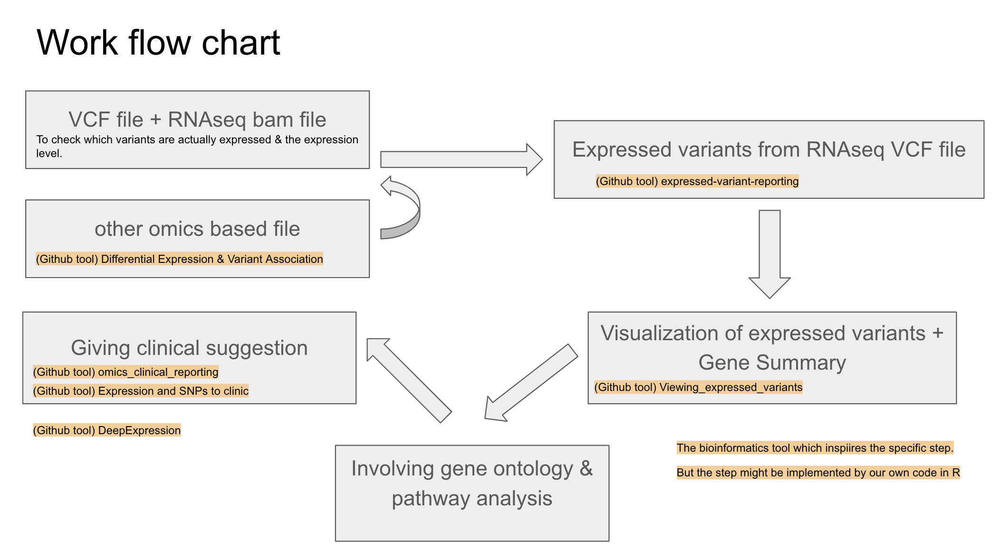
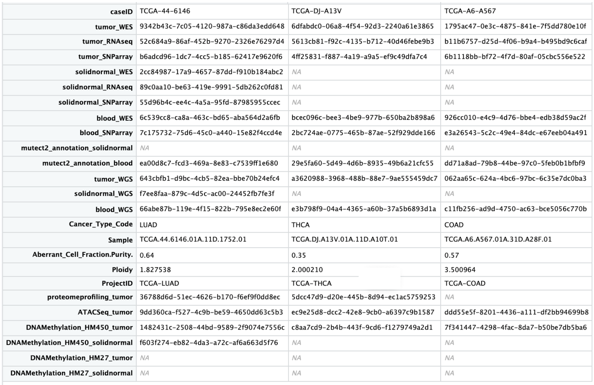
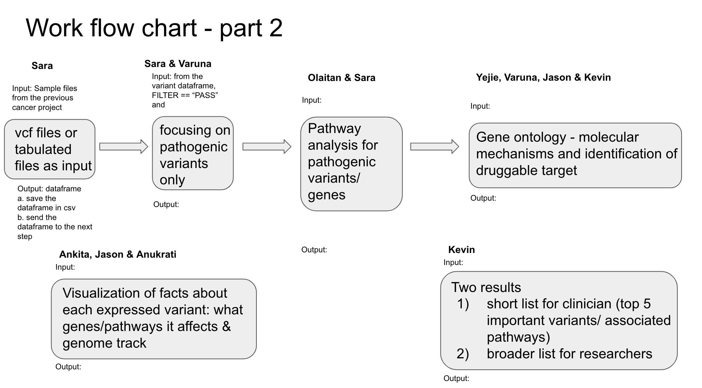

# Viewing_expressed_variants


## Contributors 
-  Kevin Elaba, Ankita Murmu, Rajarshi Mondal, Anukrati Nigam, ChunHsuan LO (Jason) - **Sysadmin** 
-  Ahmad Khleifat, Olaitan Awe, Varuna Chander - **Tech support**
-  Sara Carioscia, Yejie Yun - **Writer**
-  Kevin Elaba - **Slides construction** 
-  Yejie Yun, Anukrati Nigam - **Results presenter & advertisements** 
-  Yejie Yun, Rajarshi Mondal, Ankita Murmu, Olaitan I. Awe, ChunHsuan LO (Jason) - **Github maintenance**
-  ChunHsuan LO (Jason) - **Lead, Liaison** 


## Goal 
To visualize the expression profiles and pathways associated with variants for suggesting clinical therapy target & drug usage.


## Introduction 
(Describe)


## Idea Outlines



## Example Data 
_(Provided by: https://github.com/collaborativebioinformatics/expression_and_SNPs_to_clinic)_
-  testSample.cancer.tab <br/>
-  testSample.cancer.vcf <br/>
-  testv25.variants.HC_hard_cutoffs_applied.cancer.tab <br/>
-  testv25.variants.HC_hard_cutoff_applied.cancer.vcf <br/>
OR
_(Provided by: https://portal.gdc.cancer.gov/)_
-  TCGA-44-6164 (case ID)


## Installation & environments setup
**1.** Install the package
```
devtools::install_github("collaborativebioinformatics/Viewing_expressed_variants")
```
**2.** setting the environments
```
(codes)
```

## Methods

### Inputs:
_VCF file (sample-> online data base - 1000 genome or etc.) + RNAseq bam file_
1. Expressed variants (VCF files from RNA seq data) -> NEED TO VISUALIZE THE COLUMNS IN THE FIELDS.
2. Making technical framework for input of VCF and BAM files for both visualization of reports as well as looking at the input of the read coverage for isoforms and gene count distribution.

### Outputs:
1. Figures: Overlapping SNV site to Expression level - read coverage, distribution of pathogenic variants, which genes have the highest overlap for pathogenic variants, circular-omic plot of overlap of structural variants 
2. Table for statistics: For those annotation recorded by the VCF files 
3. Gene ontology and KEGG Pathway analysisfor the expressed pathogenic variants 
4. To suggest potential drug targets for clinical therapy.

### Detailed flow charts:



## Implementation (codes)

### (step 1) Preparing the sample files:<br/>
**1.**<br/>
```
(codes)
```

### (step 2) Data cleaning for Vcf files or tabulated files as input (Sara):<br/>
**1.**<br/>
```
(codes)
```

### (step 3) Focusing on pathogenic variants only (Sara & Varuna):<br/>
**1.**<br/>
```
(codes)
```

### (step 4) Pathway analysis for pathogenic variants & genes (Olaitan & Sara):<br/>
**1.**<br/>
```
(codes)
```

### (step 5) Gene ontology analysis - molecular mechanisms and identification of druggable target (Yejie, Varuna, Jason & Kevin):<br/>
**1. Molecular mechanisms:**<br/>
```
(codes)
```
**2. Identification of druggable target:**<br/>
```
(codes)
```

### (step 6) Results integration (Kevin):<br/>
_PS. Two results short list for clinician<br/>_

**1. Showing Top 5 important variants/ associated pathways for clinicians:**<br/>
```
(codes)
```
**2. Broader list for researchers:**<br/>
```
(codes)
```

### (step 7) Visualization (Ankita, Jason & Anukrati):<br/>
**1. Visualization of facts about each expressed variant: what genes/pathways it affects:**<br/>
```
(codes)
```
**2. Visualization of genome tracks where variants located:**<br/>
```
(codes)
```


## Example Data outputs & results
**1. Figures & Tables:**<br/>

For use by https://github.com/collaborativebioinformatics/Viewing_expressed_variants


## References 
- Data: https://XXX
- GATK Best Practices https://gatk.broadinstitute.org/hc/en-us/sections/360007226651-Best-Practices-Workflows 
- DNANexus documentation https://documentation.dnanexus.com/developer/apps/execution-environment/connecting-to-jobs 
- https://github.com/collaborativebioinformatics/omics_clinical_reporting
- https://github.com/collaborativebioinformatics/expression_and_SNPs_to_clinic
- https://github.com/collaborativebioinformatics/snpReportR
- https://github.com/collaborativebioinformatics/Differential_Expression_and_Variant_Association
- https://github.com/collaborativebioinformatics/DeepExpression (might be useful for both projects)

