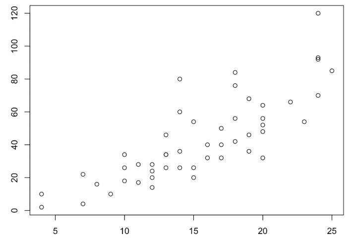

```{r setup, include=FALSE}
knitr::opts_chunk$set(echo = TRUE)
```

```{css, echo=FALSE}
@page{
  size: 8in, 11in;
}
body {
  margin: auto;
}
html {
  font-family: arial;
  width: 8in;
  height: 10.9in;
  margin: auto;
}
h2 {
  border-radius: 25px;
  padding: 10px;

}
h3 {
  text-decoration: underline;
}
#report {
  background-color: #cce7f1;
  padding: 10px;
  border-radius: 20px;
}

```
<h2 style="text-align:left;">
    VCF_file_name
</h2>

<div id = "report">
### For Clinicians:

#### Expressed Variants:

<!-- insert PNG of expressed variants table here -->
```{r cars, echo=FALSE}
summary(cars)
```
...description of variants here... \
TODO: insert topmost pathways associated with the genes - which pathway is overrepresnted \
<!-- topmost pathways associated with the genes -->
<!-- which pathway is overrepresented -->
<!-- split into 2 parts, snvs + indels, structural variants -->

#### Further Analysis:
<!-- insert PNGs of relevant plots here, add descriptions if needed -->
<!-- gene pathway + common pathway + optional flowchart -->
<!-- one figure at a time, labelled A/B/etc, comments:  -->
<center>
<figure>
    {width=500px}
    <figcaption>Figure A: ... </figcaption>
</figure>

<figure>
{width=500px}
<figcaption>Figure B: ... </figcaption>
</figure>

<figure>
    {width=500px}
    <figcaption>Figure C: ... </figcaption>
</figure>

<!-- insert 2 figures for structural variance (Jason + Ankita) -->
<!-- add description here -->
</center>
\
...description of plots here...
</div>
\

<div id = "report">
<h3> For Researchers: </h3>
<h4> Expressed Variants: </h4>

```{r genes, echo=FALSE}
summary(cars)
```
...description of variants here...
<!-- insert table of top structural variants -->
<!-- insert table of top coding variants -->

#### Further Analysis:
<!-- insert PNGs of relevant plots here, add descriptions if needed -->
<center>
{width=350px} {width=350px}
TODO: insert distribution of coding variants \
TODO: insert flowchart \
TODO: insert distribution of FATHMM prediction \
TODO: insert distribution of tissue and tumor w/in file \
<!-- insert distribution of coding variants-->
<!-- insert flowchart -->
<!-- insert distribution of FATHMM prediction -->
<!-- insert distribution of tissue and tumor w/in file -->
</center>
\
...description of plots here...

</div>
